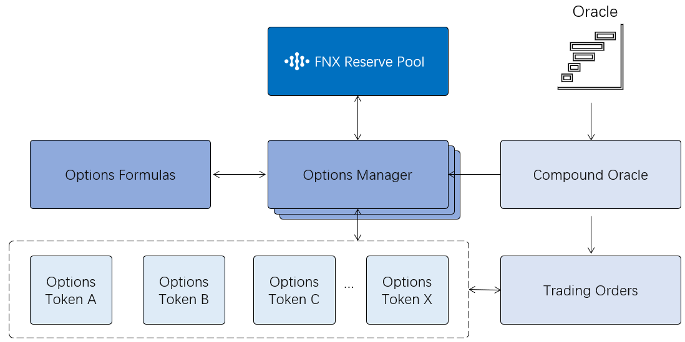

# FPO v0.1 Smart Contracts Overview

This document contains details about the Finnexus Protocol for Options (FPO). This document outlines the complete protocol, and includes descriptions of aspects of the protocol which have yet to be completed. FPO is at its core composed of a collection of smart contracts. Some of them concern the core options process, while others are for liquidity and rewards. The following diagram shows how they communicate in general: 

*FPO smart contracts*

 

## Core Components

| Name            | Source                  | ABI                     |
|-----------------|-------------------------|-------------------------|
| Options Manager | [ManagerContract\.sol](https://github.com/FinNexus/OptionsContract/blob/master/contracts/ManagerContract.sol)| ManagerContract\.abi    |
| Options Formula | [OptionsFormulas\.sol](https://github.com/FinNexus/OptionsContract/blob/master/contracts/OptionsFormulas.sol)| OptionsFormulas\.abi    |
| Compound Oracle | [CompoundOracle\.sol](https://github.com/FinNexus/OptionsContract/blob/master/contracts/CompoundOracle.sol)| CompoundOracle\.abi     |
| Trading Orders  | [MatchMakingTrading\.sol](https://github.com/FinNexus/OptionsContract/blob/master/contracts/MatchMakingTrading.sol)| MatchMakingTrading\.abi |
| Options Token   | [IERC20\.sol](https://github.com/FinNexus/OptionsContract/blob/master/contracts/IERC20.sol)| IERC20\.abi             |

## Options Manager Contract

**Responsibilities:**

* Manages underlying assets and collateral  
* Creates and manages option types  
* Issues additional option token supply  
* Liquidation   
* Exercising  
* Setting transaction fee rate  
* Interacts with others contracts  

This is the main contract for FOB 1.0 which is composed of a number of sub contracts. It runs all functions directly related to options. It gets token price information from the compound oracle contract to run necessary calculations. It also triggers the deployment of new options token contracts and issues new options tokens when all conditions are fulfilled. It handles calculation of collateral coverage, liquidation and exercising. Calculations are performed using the formulae defined in the options formula contract. 

## API Overview
 
### `getOptionsTokenInfo()`

**Description:** Gets the information of existing options

**Subscribe:** `function getOptionsTokenInfo(address)public view;`

**Parameters:**

* **address-string:** The address of the options token

**Return Values:**

* `uint8:` Type of option. “0” for “call”. “1” for “put”   
* `address:` Address for collateral  
* `uint32:` Type of underlying asset  
* `uint256:` Strike price  
* `uint256:` Expiration  
* `bool:` If the options token is exercised  

### `getLiquidationIncentive()`

**Description:** Gets the percentage of liquidation compensation

**Subscribe:** `function getLiquidationIncentive()`

**Parameters:**

* None

**Return Values:**

* `uint256`: value   
* `int32`: exponent. The percentage of liquidation incentive: `value * pow(10 , exponent)` 

### `addCollateral()`

**Description:** Deposits collateral

**Subscribe:** `function addCollateral(address optionsToken,address collateral,uint256 amount,uint256 mintOptionsTokenAmount) `

**Parameters:**

* `address optionsToken-string`: The address of the options token.  
* `address collateral-string`: The address of the collateral token. If token is a native token such as ETH or WAN, input “0”. If token is ERC20, input address of token.   
* `amount-uint256`: The amount of collateral you want to deposit. If it is a native tokens, amount is not available. You should send native tokens in this transaction. Inputting “0” is acceptable.  
* `mintOptionsTokenAmount-uint256`: The amount of options token you want to mint. The amount that could be mint  is limited by the formula of collateral.  

**Return Values:** 

* None

### `withdrawCollateral()`

**Description:** Withdraw collateral

**Subscribe:**  `function withdrawCollateral(address optionsToken,uint256 amount)`
**Parameters:**
* `address-string`: The address of the options token  
* `amount-uint256`: The amount you want to withdraw. The amount you can withdraw is the part above the bottom of collateral which is used to mint the options token.  

**Return Values:** 

* None  

### `burnOptionsToken()`

**Description:** Destroy previously minted options token  

**Subscribe:**  `function burnOptionsToken(address optionsToken,uint256 amount)`
**Parameters:**
* `address-string`: The address of the options token  
* `amount-uint256`: The amount you want to destroy. The amount should be below the total amount in the address.  

**Return Values:**

* None

### `exercise()`

**Description:** Exercise options

**Subscribe:**  `function exercise()`
**Parameters:**
* None - Exercises all options tokens which are past expiration time  

**Return Values:**

* None

### `liquidate()`

**Description:** Performs liquidation

**Subscribe:** `function liquidate(address optionsToken,address writer,uint256 amount)`

**Parameters:**

* `address-string`: The address of the options token  
* `address writer-string`: The address of writer you want to liquidate. When the percentage of collateral of writer is below the bottom before expiration, liquidation can be done.  
* `amount-uint256`: The amount of the options token you want to liquidate. The amount should be below the amount minted in this writer’s address.  

**Return Values:**

* None

## Options Formulas Contract
**Responsibilities:**
* Manages collateral formulas.
* Interacts with options manager contract.
This contract contains a number of formulas which control collateral percentage. When other contracts need to calculate collateral limits, the contract will be triggered to calculate and give the result.  

## Compound Oracle Contract
**Responsibilities**
* Receives price data of token and currency from outside oracle sources.
* Interacts with other contracts.
All price data needed in the FinNexus Options Protocol are stored in this contract. Other contracts interact with it to get prices as needed. It is a bridge between internal contracts and outside oracle sources.

## Options Token Contract
**Responsibilities**
* Manages options tokens.
* Manages issuing, transaction, and account information of options tokens
Each options token is an independent contract which is deployed automatically by the options manager contract. The contract is special ERC(WRC)20 contract with an expiration time. After expiration, the token is invalid and cannot be transferred. The tokens otherwise meet all ERC(WRC)20 standards.

## Trade Orders Contract
**Responsibilities**  
* Matches orders for selling and buying.  
* Supplies a tool for market makers.  

This contract  is relatively independent of the core options contracts, it is used for providing liquidity for options tokens. It helps traders buy and sell options tokens easily. It is intended as a temporary solution for providing liquidity. In later versions we intend to use a more decentralized model of liquidity which would not rely on  trusted market makers.

