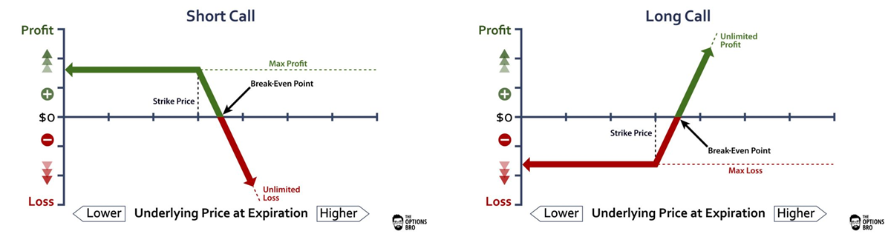
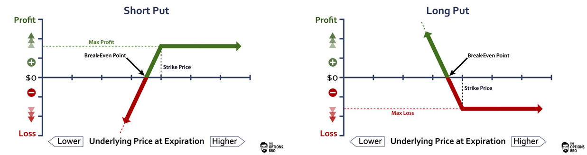

*See our [Key Terms](terms.md) page for an explanation of some of the key options terms used throughout this section.*

## What is an option?

An option is a binding contract that allows you (as the buyer) to sell or buy an underlying asset (goods, stocks, indexes, etc.) at a predetermined price within a set time frame. You as the buyer of an option contract, have the right, but not the obligation, to buy or sell the underlying asset. That’s the big difference between options contracts and futures contracts. With futures you are obligated to take delivery of the underlying asset. In the case of oil, since there are some costs associated with delivery and storage of the underlying, futures contracts can actually be negatively priced!

With options, in order to get that right to buy or sell a particular asset at a predetermined price, you have to pay the option seller a price, which is called the **option premium**.

*Photo by [Nathan Hulsey](https://unsplash.com/@nhulz?utm_source=unsplash&utm_medium=referral&utm_content=creditCopyText) on [Unsplash](https://unsplash.com/s/photos/apple?utm_source=unsplash&utm_medium=referral&utm_content=creditCopyText)*

 
 

For example, a fruit store wants to buy 500 kg of apples from an orchard owner, but the apples are not ripe yet until August. The fruit store worries about the rise of the price, affected by drought this year. Therefore, it reaches an agreement with the orchard owner, that it may purchase the apples at the price of $4/kg in August. But it doesn’t have to do so if there is some cheaper price on the market. In order to have this right, the fruit store pays the orchard owner $100 as compensation.

The contract above is a typical option. It is called a [Plain Vanilla](https://www.investopedia.com/terms/p/plainvanilla.asp) call option.

The following terms are essential to understanding the nature of options products. Bookmark this page for future reference!

## Option Buyers and Sellers

Each option contract has two parties, the option buyer/holder and the option seller/writer. Unlike a futures contract, with options, the rights and obligations of the two sides of this equation (called “counterparties”) are not parallel. The option buyer pays the option premium and is entitled to rights only. The option seller receives the premium as consideration for giving up those rights.

## Security Requirements

Due to the counterparty relationship described above, the buyer/holder of an option may just sit there and see how the market goes, waiting to decide whether to exercise the right or not. On the other hand, the seller/writer of an option has an obligation. Whenever the holder decides to exercise his option, he/she must settle according to the terms of the option contract. Therefore, a security deposit or collateral of some sort, must be handled to ensure the contract will perform accordingly.

## Risks

The buyer and seller of an option contract will be exposed to very different levels of risk.

In buying options, the risk is limited to the premium paid for the option — no matter how much the actual underlying asset price moves adversely in relation to the strike price. For example, in the apple example from my previous post, the fruit store, as the option buyer/owner, has a maximum potential loss of $100. If the price of apples actually drops in August, it may just choose not to exercise the option contract.

In selling options, the risk can theoretically be unlimited, if the option seller/writer chooses not to hedge his position in some other transaction. When selling a call option, if the price rises above the strike price, it is in the best interest of the option holder to exercise the right to purchase the underlying asset at the previously agreed upon strike price, since it would be cheaper than the current market price. Because the option writer is locked into this strike price due to the obligation that was incurred when accepting the option premium, the option seller is subjected to losses, with theoretically no potential limits. For example, in our apple example, if some drought happens and the market price of apples doubles or triples, but the orchard owner is contracted to sell at $4/kg, they will have big losses compared to what they could have received if they had not sold the option. The higher the market price is, the more the orchard owner will suffer.

## Potential Returns

Due to the unparalleled nature of the rights and responsibilities of the buyer and seller, their returns are also distributed quite differently. An option seller (which is effectively a short position on the derivative contract) can only profit from the receipt of the option premium, yet may suffer from losses if the market price moves in unfavorable directions.

**(1) The profit-loss chart of shorting (selling) and longing (buying) a call option looks like this:**

*Call options chart*

 
 

A *call* is a bullish position on the underlying asset.

When shorting a call, one is at profit in the green zone, when the price is not higher than the Break-even point. The maximum profit for the option writer/seller is the amount of the premium when the price is not higher than the strike price and therefore the option would not be exercised, expiring worthless. When the option seller/writer is at a loss in the red zone, there is no limit to the losses as the market price rises.

When longing a call, the option contract will not be ‘activated’ if the market price is lower than the strike price. Hence, the option buyer/holder is paying a premium for nothing. However, when the price moves above the strike price, the option buyer/holder will exercise the contract; but he/she will still be at a loss on the investment until the price of the option reaches the Break-even point, which is the amount of the option premium. As the price of the option moves above this threshold, the profit for the option buyer/holder increases, with theoretically no limit. The only bound is the time to expiry of the option.

**(2) The profit-loss chart of shorting (selling) and longing (buying) a put option looks like this:**

*Put options chart*

 
 
Remember that a *put* is a bearish position on the underlying asset. It is a right to sell the underlying asset at a particular strike price. It is the opposite of a call option.

When shorting (selling) a put (which is a bullish position on the underlying asset), one is at profit in the green zone, when the price is not below the Break-even point. The maximum profit for the option seller/writer is the premium paid for that option when it was created. The goal for the option seller/writer is that the price of the underlying asset remains higher than the strike price obligated in the option contract, meaning that the put option would not be exercised. The option seller/writer is at a loss in the red zone. The loss will be more significant as the market price decreases.

When longing (buying) a put (which is a bearish position on the underlying asset), the option contract will not be ‘activated’ if the market price is higher than the strike price; hence the buyer is paying a premium for nothing. However, if they also hold the underlying asset, they still will enjoy the gains from the price appreciation there. In this scenario, the put option functions as **insurance** for the holder of the underlying asset.

The put option itself is in profit for the option buyer/holder when the price of the underlying asset moves under the strike price. Then, the holder will exercise the contract. However, the option buyer/holder remains at a loss on the investment until the the price rises above the break-even point, which is the price that was paid for the option premium. The profit of the option buyer/holder increases as the price of the underlying asset moves even lower.

## How options are priced

There are several popular options pricing models, like the [Black Scholes Model](https://www.investopedia.com/terms/b/blackscholes.asp) and [Binomial Option Pricing Model](https://www.investopedia.com/terms/b/binomialoptionpricing.asp#what-is-the-binomial-option-pricing-model). I am not going to delve into the mathematical details of these models, yet it is useful for option investors to learn the basic interrelations among the different factors affecting the price.

*Basic factors affecting the price of an option*

 

1. If the market price of the underlying asset increases, the buyer/holder of a call option will be more likely to exercise the call option. They would receive more benefits by exercising the call option and owning the underlying asset. Hence, in this bullish scenario, the right conferred by the call option brings more positive economic benefits to the option buyer/holder and the call option will have more value. The option buyer/holder can also choose to sell the option itself rather than exercising the option. They still benefit from the increase in economic value. In the case of put options, the case will be the opposite. In short, the market price of the underlying asset will have a positive correlation with the call option price, while it has a negative correlation with the put option price.
2. If a call option has a lower strike price, it means that the holder will have a right to buy the underlying asset at a cheaper price. Thus, the right contained in the option will be more likely to bring economic benefits to the option buyer/holder. As a result, the call option will be priced higher on the market. While for a put option, the case will be the opposite. In short, the higher the strike price of an option contract has a negative correlation with the price of a call option, while it has a positive correlation with the put option price.
3. The longer the time to expiration of an option, the more uncertainty an option writer/seller is exposed to. Thus, the right given to option holders/buyers has a higher value. The same logic applies to both call and put options. With more time, there is more chances to have explosive movements in price, especially in the cryptocurrency markets. Therefore, option price is positively correlated with the time to expiration.
4. The higher the price volatility of the underlying asset, the less predictable is the future price of that asset. Thus, the right conferred to option holders/buyers has more value. From the same perspective, the risk undertaken by the option writer/seller is much higher, which gives them the ability to charge more for the option premium. Therefore, the option price is positively correlated with volatility.

 