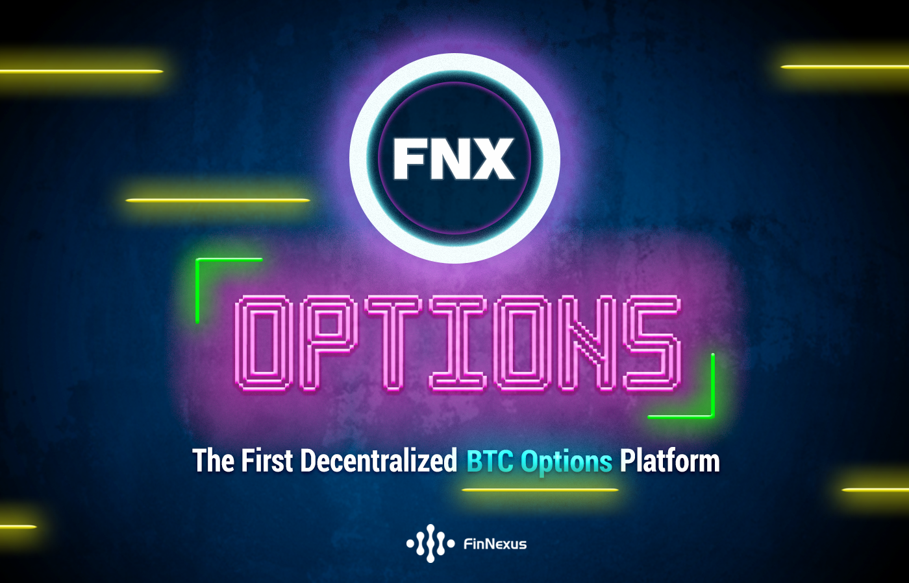
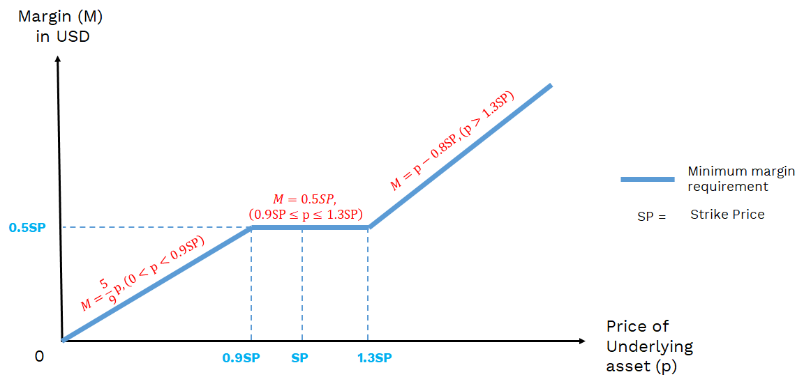
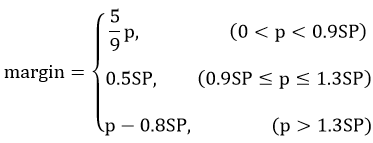
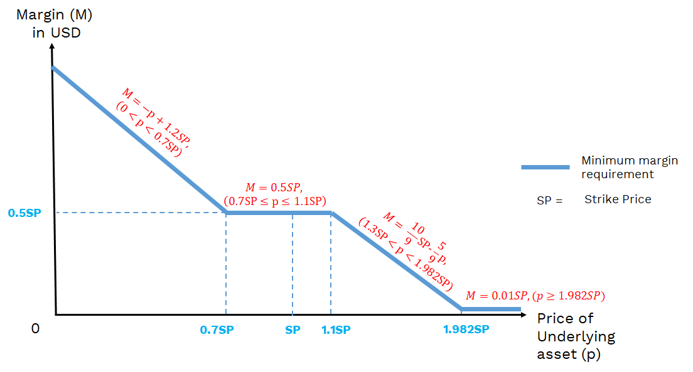
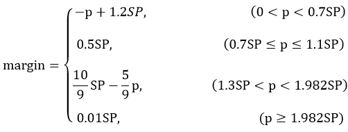
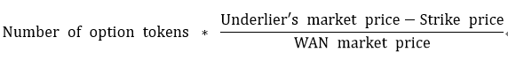
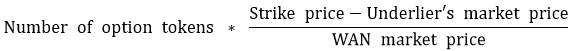
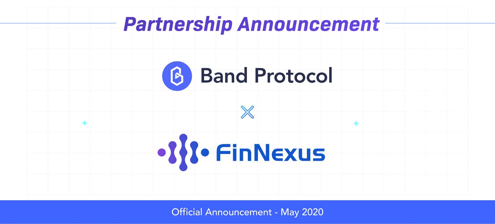
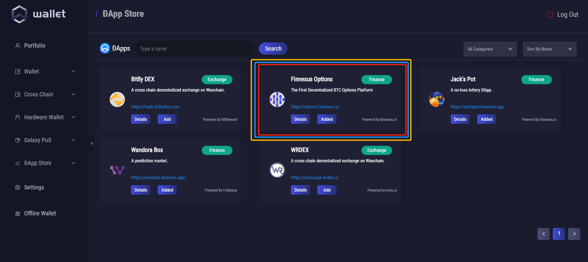

# FinNexus Protocol for Options (FPO) v0.1 (currently terminated for later upgrades)
The FinNexus Protocol for Options supplies a decentralized way for writing and trading options. All the core functions of options - writing, trading, exercising, settlement, etc., occur on chain and are managed by smart contracts. It is a permissionless, censorship-resistant, and non-custodial protocol.  

*FinNexus Options*

 

## What are FinNexus options?
The FinNexus options in FPO v0.1 are tokenized options that give the holders the right, but not the obligation, to buy or sell underlying crypto assets at a specified price (Strike Price) at expiration. **The uniqueness of the FPO protocol lies in its 1) unique liquidity mechanism, 2) dynamic and multi-coin margin mechanism, and 3) liquidation mechanism, each of which is described in its own section below.**

Every option supported by the FinNexus Protocol for Options (FPO) is integrated through an option token smart contract which is a WRC20 compliant representation of options on Wanchain. Later, when we modify these smart contracts for our Ethereum-based platform, the option tokens will be ERC20 compliant. These option tokens are transferrable, fungible, and can integrate or be integrated with other DeFi protocols.

For those who are unfamiliar with options in general, please review our [What are options?](guide.md) and [Key Terms](terms.md) sections before continuing in this section.

## How to read a FinNexus option token symbol?
A FinNexus token symbol is combined with a symbol of the underlying asset, a tag indicating whether it's a put or a call, along with its expiration and strike price.

For example, ***'BTC, put, Jul 03 2020, $9000'*** means a BTC put option with an expiration date, sometimes called a maturity date, of 2020 July 3rd and a strike price of $9000.

## Writing Options/Minting Option Tokens
FPO is permissionless and anyone can be an option writer by depositing enough collateral into the contract. In FPO v0.1, the creation of the types of options is controlled by the FinNexus Foundation account. For instance, to control risk during these beta stages, only the Foundation will be able to decide what types of options (put/call, expiration, strike) are available for minting. At later stages, this functionality will be open to the public.

Just as with options in traditional finance, the sellers or writers of options need to deposit some form of collateral as margin in case the contract gets exercised. In FPO v0.1, users can choose to write/mint options tokens by locking an equivalent amount of value denominated in acceptable crypto assets as collateral into the FPO smart contracts. In FPO v0.1, both FNX and WAN can serve as collateral for these contracts. In one transaction, the collateral is posted into the smart contract and the corresponding amount of options tokens are created and transferred to the writer's same address.

The minted option tokens can then be directly sold to capture the premium through the FinNexus options platform. Selling an option token means selling the buyer the right to buy or sell a crypto asset at a specific price (strike price) at a specific date. The writers need to take the equivalent risks with the possible exercising of the options. In addition, they could also consider hedging their exposure by buying other options available on the platform.

In FPO v0.1, the type of options provided is European, which means the buyer can only exercise the contract at the time of expiration. Users may have more flexible choices in later versions of the protocol.

FinNexus option tokens will be tradable anytime up until 5 hours before maturity. At that time, trading will be halted and settlement will occur at UTC 8:00am of the expiration date of the option.

For minting and selling option tokens, options writers will be compensated with premiums. Transaction fees and liquidity mining incentives will also accrue to liquidity providers. Details are yet to be released on these exciting initiatives. Be sure to follow us on [Twitter](https://twitter.com/fin_nexus) or [Telegram](https://t.me/FinNexusOfficial) to know as soon as we make these announcements!

## Buying Options

FPO v0.1 will provide a trading venue for option tokens transactions. Option tokens can be bought by using the buy function.

No collateral or margin is needed for the option buyer to buy option tokens. However, he/she needs to transfer the equivalent amount of crypto assets (at first, this will be denominated solely in WAN or FNX, but will be expanded to include other assets later)  into the order system, as the payment for the options premium.

By purchasing a call option token, you are taking advantage of leverage, allowing you to use less money to gain positive exposure to the price of the underlying assets. The interesting part is that these assets do not have to be the same as those provided as collateral.

By purchasing a put option token, you are buying protection or insurance, to protect yourself against potential price drops of the underlying asset. Essentially, you are betting against an increase in the token price.

Users can combine different kinds of options to create complex trading strategies. For instance, one could buy a BTC call at a strike price of $ 10,000 with December expiry and a BTC put at a strike price of $9500 with August expiry. A novel strategy like this one essentially creates a synthetic long BTC position with short-term downside protection, without having to commit $10,000 worth of capital to do it! This is just one example of how options trading strategies make the use of capital extremely efficient.

Also, the option sellers may buy back the minted option tokens and close the exposure of the equivalent options.

## Selling Options
Once a user buys option tokens through FPO v0.1, he/she can sell it in part or in full anytime up until 5 hours before expiration, provided there is adequate liquidity on the market.

Also, after option tokens are minted by a writer, he/she may sell the options for premium returns through FPO v0.1.

## Unique Liquidity Mechanism
FinNexus will provide an active and liquid exchange market for the circulation of the option tokens.

FPO v0.1 provides an exchange venue with order books for users to buy and sell options tokens. FinNexus has developed a smart contract, which you can find [here on Github](https://github.com/FinNexus/OptionsContract/blob/master/contracts/MatchMakingTrading.sol), that was specifically created to match orders for selling and buying option tokens during this phase of development. This smart contract is relatively independent of the core options contracts, having been deployed for providing liquidity for FPO options tokens in a user-friendly way. 

Users may press the **'Hedge Now'** or the **'Leverage Now'** button for buying put or call options respectively. The upper volume for purchasing at the time of the transaction is shown in the **'Liquidity'** column. After a purchase, there will be a **'Sell Now'** button at the end of the **'My Asset'** section, where option tokens may be sold partly or in full.

In FPO v0.1, the bid and ask price will be provided in a simple manner, where the buyer or seller may take it or leave it in reference to the designated price. The buying and selling orders will be matched based on their time sequence.

It is intended as a simplified solution for providing liquidity in FPO earlier phases. The FinNexus Foundation will provide the initial market-making operations for the liquidity of the option token circulation.

In later versions of the FPO, FinNexus intends to use a more decentralized model that integrates with other DEX (decentralized exchanges) like [Rivex](https://www.rivex.io) on Wanchain and AMM (automatic market makers) like [Uniswap](https://uniswap.exchange) and [Balancer](https://balancer.exchange/#/swap) on Ethereum. Ideally, in these later iterations, liquidity will not rely on centralized parties, allowing transactions to be exercised more equally, openly, and with more depth.

## Dynamic and Multi-coin Margin Mechanism
One of the more unique aspects of FPO v0.1 is how the margin mechanism works to include multiple assets as collateral. This section will introduce how this works.

### What is Dynamic Margin?
FPO v0.1 is the first decentralized options protocol to utilize this Dynamic Margin Mechanism. It is a mechanism that allows the minimum requirement of margin backing the options to change dynamically along with the underlier's price fluctuations.

The seller/writer of options must first deposit and collateralize a certain amount of margin (collateral) in the contract to ensure the exercise and performance of the contract. After the contract is live this collateralization threshold is subject to change.

### Why use Dynamic Margin?
To make the options secure, most of the decentralized options platforms currently on the market require the full lock-up of the related crypto assets at strike price into the smart contracts as collateral/margin. For example, one ETH should be collateralized for writing one ETH call option. It is simple and direct for physical settlement, but it is not so flexible for the users. First, the types of collateral assets are fixed according to the options essentials, leaving no choice for the option sellers. Second, the writers need to lock up the full amount at the strike price upon expiration or exercising, which is capital inefficient. Third, the smart contract requires physical settlement upon exercise, which these days can be quite expensive in gas. 

To solve the potential deficiencies above, FPO v0.1 proposes that the margin accepted should include a larger variety of assets for deposit. This collateral must at least cover the gains for option holders who exercise by cash settlement. 

To make the options fully backed, in theory, the minimum margin requirement should cover the potential gains of the option holders from exercising, which means that margin provided should at all times be equivalent to the [intrinsic value](https://www.investopedia.com/articles/optioninvestor/07/options_beat_market.asp#:~:text=Intrinsic%20value%20is%20the%20value,stock's%20price%20in%20the%20market.) of the options. For example, for a $9000 BTC call option, when BTC is $9250, the collateral should be at least $250 to cover the potential profit of the option holders.

However, considering 1) the penalty of compulsory liquidation, 2) the fluctuation of the margin crypto assets and 3) the preference to reduce liquidation risks when the market suffers from extreme volatility, the required margin in the smart contracts should, in general, greatly ***exceed*** the amount above.

At the same time, to simplify the model and implementation, a so-called dynamic margin design is applied in the FPO v0.1 smart contracts as follows. The minimum margin required dynamically changes according to the price of the underlying assets relative to the strike price, or the degree of ["moneyness"](https://www.investopedia.com/articles/optioninvestor/08/option-moneyness.asp) of an option.

A more complicated dynamic margin model will be applied in later versions of FPO to further enhance efficiency and security.

### Multi-coin Collateral
FPO smart contracts provide the potential for multi-coin collateral function, meaning that there could be a variety of crypto assets (WRC20s on Wanchain and later ERC20s on Ethereum) used as collateral/margin for minting option tokens. As long as those cryptoassets are whitelisted in the FPO smart contracts, they can be accepted as collateral for minting option tokens. 

In FPO v0.1, FNX and WAN are the two collateral asset choices for the writers on Wanchain. More cryptoassets will be whitelisted in the future.

### Call option margin
The writer of a call option must lock up the required margin in the FPO smart contract to mint option tokens. In cases where the price of the underlying asset rises, especially if it exceeds the strike price and the call becomes ITM (in the money), the option seller will bear the loss after exercise. As such, the writer's margin requirement would increase.

If the price of the underlying asset drops and is lower than the exercise price and the call becomes OTM (out of the money), the buyer becomes less likely to exercise. As a result, the margin required can be reduced accordingly.

The blue bold polyline in the chart below is the **dynamic minimum margin requirement** for a FinNexus call option writer. If the deposited USD value of the collateral is above the polyline, it means the collateralization ratio is over 100%. Fully collateralized positions like this are considered to be safe. If it drops below the line, meaning that the collateralization ratio becomes less than 100%, the position is regarded as unsafe by the smart contract and will be liquidated. More specific information about the liquidation process for FPO v0.1 is included in the **Liquidation** section below.

*The minimum margin requirement for FinNexus call options*

 

 
 

For example, for a BTC call option with a strike price of $7000, when 6300 ≤ market price P ≤ 9100, the minimum margin required is $3500 (0.5*$7000), which means when the writer deposits $7000 margin into the SMC, he or she may mint up to 2 option tokens (though it is strongly recommended that one should always reserve some room for the market fluctuation). When the BTC price P is $5400, the minimum margin for minting one option token is $3000; while, when the BTC price P is $10000, the minimum requirement is $4400.

### Put option margin
The writer of a put option must lock up the option margin (collateral) in the smart contract. In cases where the price of the underlying asset drops, especially when it becomes lower than the strike price, and the put contract becomes ITM, the option writer bears the loss after the exercise. In principle, the margin requirement of the writer will be increased in this case. 
If the price of the underlying asset rises, especially when it becomes higher than the strike price, and the put contract becomes OTM, the likelihood that the buyer will not exercise increases. As such, the minimum margin requirement in the contract would be eligible to be reduced accordingly.

Essentially it is somehow the inverse of the margin requirements for call options. The blue bold polyline in the chart below describes the dynamic minimum margin requirement for a put option writer. If the deposited USD value of the collateral is above the polyline, it means the collateralization ratio exceeds 100% and the position is considered safe. If it drops below the line, it means the collateralization ratio is less than 100% and the position is considered unsafe. 

As with call option margin mentioned above, once the position is regarded as unsafe by the smart contract it is subject to liquidation. More specific information about the **Liquidation Mechanism** for FPO v0.1 is included in the next section.

*The minimum margin requirement for FinNexus put options*

 

 
 

It is noted that in cases when the price of the underlying asset is OTM by a great extent, say for example it is trading at 1.982x the strike price, in order to avoid the margin falling below zero, the protocol keeps a minimum margin requirement to the level of 0.01SP.

### What is the designated "minimum margin requirement"?

Now that we have explained the concepts of dynamic margin with multi-coin collateral and the polyline formula for both put and call option margin, it is now easier to describe what we mean by the "minimum margin requirement." If you look back over the previous documentation, you will see this term used quite a lot.

The "minimum margin requirement" is simply the polyline in the charts above. It is designated in the FPO smart contracts to determine the minimum collateral required for minting option tokens. One may notice that this "minimum margin requirement" is a lot higher than covering the difference when doing a cash settlement of option. This buffer is required to maintain the security of the protocol. But it is still far more capital efficient than storing the entire value of the underlying asset in the smart contract.

Also to be clear, the "minimum margin requirement" is an important concept in the FPO, as it is used in calculating the Collateralization Ratio and is dynamic to the degree of 'moneyness' found in the minted options.

Collateralization Ratio essentially measures how well the option tokens are backed, relative to the margins deposited by the option writers. The Liquidation Ratio measures the critical point when the position is considered unsafe and subjected to a liquidation event. These terms will be specifically defined below.

This section fully describes the unique dynamic and multi-coin margin mechanism operating in the FPO smart contracts. The next section describes what happens when the margin threshold defined in the FPO smart contacts is crossed.

## Liquidation Mechanism
Corresponding margin/collateral (the minimum margin or the polyline above in the chart) will be locked when the option tokens are minted and will not be unlocked before expiration. Options writers may choose how many options tokens to create, but they must ensure that the value of the collateral is above the minimum margin requirement, which is described by the polylines above.

When a writer's margin (collateralization ratio) falls below the minimum requirement, anyone who holds the equivalent minted options tokens, could transfer some or all of the number of outstanding tokens minted by the writer, into the smart contract, acting as a liquidator, to liquidate the position. The liquidator may, in return, get a discounted amount of collateral held by the writer. This discount serves as one of the liquidation incentives. Liquidators may also earn a liquidation penalty from the liquidated option writer.

After expiration, corresponding collateral will be unlocked and can be redeemed by the writers. However, option writers/minters can withdraw the collateral at any time before expiration as well, whenever the value of the posted collateral is above the margin requirement as indicated by the polyline in the graphic above. Of course, they should keep in mind that the closer to the polyline their margin amount gets, the more subject they are to liquidation risk.

### What is Liquidation?

Liquidation is the process of selling collateral to cover a user's generated option tokens. When collateral coverage is below the minimum margin requirement, there is a risk that collateral may be inadequate to cover the exercise of the option contract. During the liquidation process, margin/collateral will be transferred from the smart contract governing the option tokens to the liquidator's wallet. An additional **liquidation penalty** shall be assessed on the options writer/minter that serves as an additional incentive to potential liquidators.

Liquidation helps to ensure that the potential cash settlement of option tokens is always fully backed by an appropriate amount of collateral that is above the minimum margin requirement.

### What is the difference between Collateralization Ratio and Liquidation Ratio?

The Collateralization Ratio is the ratio of the actual value of collateral/margin compared to the minimum margin requirement(the Polyline in the charts above). When calculated in reference to a single option token, the formula is simple:

> *Collateralization Ratio = value of collateral / minimum margin requirement*

Remember here that **the collateralization ratio here is not calculated based on the physical settlement of the underlying asset position, but rather on the dynamic minimum margin requirement, which balances the cash settlement, the safety of the protocol, and the conciseness of maths. That's the big difference that makes this FPO v0.1 method much more capital efficient than other DeFi options platforms.**

The Liquidation Ratio is the minimum required collateralization ratio for each option token before it would be considered undercollateralized and subject to liquidation. **In FPO v0.1, the Liquidation Ratio is set to 100%**, which means that the value of the collateral should at least be no less than the value of the minimum margin requirement.

> *Liquidation Ratio = Minimum Collateralization Ratio that must be maintained to avoid potential liquidation (set to 100%)*

FPO oracles will provide the system with price data used to track whether or not the Liquidation Ratio is breached. Once breached, the positions will be exposed to potential liquidation.

Following the examples above, for a BTC call option with a strike price of $7000, when $6300 ≤ market price P ≤ $9100, the minimum margin for writing one option contract is $3500 (0.5 * $7000). If the writer deposits  $7000 worth of FNX tokens into the smart contract as the collateral, then the collateralization ratio will be 200% ( $7000 / $3500).

Due to the uniqueness of the FPO protocol, please note that the collateralization ratio is subject to changes due to the price movement of both the underlying asset and the collateralized assets.

The Collateralization Ratio for option writers collateralizing FNX and WAN are separately calculated in FPO v0.1.

### What is the Liquidation Penalty/Incentive?
In order to enhance the security of FPO and make sure the options are adequately backed, an option writer that does not maintain the minimum margin requirement will be subject to a Liquidation Penalty. This penalty will serve as an additional incentive to potential liquidators. By removing undercollateralized positions from the system, these liquidators ensure the robustness of the FPO protocol.

A Liquidation Penalty is assessed on liquidated writers, who will suffer a loss from the value of the collateral when liquidated by others. This loss will be distributed to the liquidators as a Liquidation Incentive.

The Liquidation Penalty/Incentive in FPO v0.1 is 20% of the bid value of the option token when transferring crypto assets into the smart contract for liquidation. 

For example, an FPO user mints one call option token with a strike price of $9000, with $4600 WAN as collateral. At the time of minting, the minimum margin requirement was $4500 according to the polyline. The collateralization ratio was 102.22% ( $4600 / $4500).

Now let's suppose the BTC market price rises to $9500. While the minimum margin requirement remains $4500 according to the polyline, the USD value of the WAN collateral drops 5% to $4370, dropping the collateralization ratio to 97.11% ( $4370 / $4500) and below the Liquidation Ratio of 100%. Hence, this position will be liquidated. At this new $9500 price, suppose the bid price for one BTC option token is now $600. The liquidator will instantly receive WAN collateral locked in the smart contract amounting to $720 (based on this $600 value plus a 20% liquidation penalty) after liquidating one BTC option token. The liquidated writer can withdraw the rest of his WAN tokens, originally provided as the margin, which now amount to $3650 ( $4370 – $720).

### What happens during a Liquidation?

* The protocol detects when the collateralization ratio falls below 100% and triggers a liquidation occasion  

* The collateral is put up for liquidation  

* Liquidators may transfer some or the full amount of the option tokens into the smart contract, and the equivalent value of the collateral will be paid back into the same address, including the Liquidation Incentive  

* The same amount of collateral will be deducted from the writer's margin account, including the Liquidation Penalty  

* The amount of Liquidation Penalty/Incentive will be calculated from the USD value of the option tokens, when transferring into the smart contract for liquidation   

* The Liquidation Penalty/Incentive is 20% of the bid value of the option token when transferring into the smart contract for liquidation  

* The option tokens sent into the smart contract for liquidation are burnt  

* When the collateralization ratio is above 100% after a certain liquidation process, further liquidation will be ceased, and the remaining options will be regarded as fully collateralized.  

* It is strongly advised that the writers should always keep a healthy position and closely monitor the collateralization ratio above the liquidation level. Please be noted that in FPO v0.1, there will not be a direct interface to monitor the collateralization ratio. A more comprehensive dashboard will be provided in later versions.  

### How can you become a liquidator?
Anyone can be a liquidator, liquidate undercollateralized positions and claim the liquidation incentives.

The liquidation interface is still under development in FPO v0.1, but anyone is free to participate through API from [here](https://github.com/FinNexus/OptionsContract).

## Exercising FPO Options

### When can I exercise my FPO option?
The FinNexus option tokens in FPO v0.1 will be European type and therefore can only be exercised upon expiration.

### Should I exercise my FPO option?
Whether it is financially beneficial for FPO option holders to exercise will be judged by the system of oracles and smart contracts.

Options will be automatically exercised upon expiration if the contract is ITM (in the money). From the perspective of the option holder at expiration, when the strike price of the call option is lower than the underlying asset's current price, the contract is ITM. For put options, when the strike price is above the underlying asset's current price, the contract is ITM.

### How do I exercise my FPO option?
Don't worry, there's nothing that an FPO token holder needs to do. The FPO smart contracts will automatically exercise when the options are ITM at expiration. If the options are ATM (at the money) or OTM (out of the money), the exercising of the option token will not be triggered.

### What happens when I exercise my FPO option?
FinNexus options will be cash-settled, which means that only the difference in price will be settled. The difference between the strike price and the market value of the underlying asset will be exchanged into the margin\collateral assets by smart contracts and transferred into the option holder's address.

For example, a call option, backed by WAN, is in the money at expiration, the option token holder will get the following amount of WAN when exercising:

 
 
A put option, backed by WAN, is in the money at expiration, the option token holder will get the following amount of WAN when exercising:
 

 
 

The same logic applies to other collateralized crypto assets.

After expiration, whether exercised or not, the related option smart contracts will be terminated.

The gas fees of automatic exercising option contracts at expiration will be undertaken by the FinNexus platform in FPO v0.1.

## Oracles and Price

In FPO v0.1, all values of all crypto assets, including both the collateral assets and underlying assets, will be calculated and measured in US dollars. At this point, all related token prices necessary for calculation - currently FNX/USD, WAN/USD, and BTC/USD - are fed by API. All price feeds refresh every 5 minutes.

However, the next step in the development of the protocol is to work with our partners, Band Protocol, to integrate  price feeds fed by decentralized oracles directly written into the FPO smart contracts.

 
 

This project will be the first work that we will undertake within the scope of our [partnership with Band Protocol](https://medium.com/bandprotocol/interoperable-defi-platform-finnexus-chooses-band-protocol-to-power-synthetic-real-world-assets-9feb777183c9).

## Security and Fees

### Security
FPO v0.1 has not been audited yet, and can currently be considered experimental software. The code is publicly available at FinNexus's [GitHub](https://github.com/FinNexus/OptionsContract). We've made a considerable effort in order to create a secure protocol, but please don't supply your life savings or assets you can't afford to lose. When an audit is performed the results will be published publicly through FinNexus's official channels.

### Fees
FPO v0.1 is free of charge except:
There is a 0.3% transaction fee when buying and selling options on the FinNexus exchange venue.
There is a 0.3% fee collected from the holders, when exercising the options at expiration; and a 0.3% fee collected from the liquidator when liquidating.

### User interface

FPO v0.1 will provide a user-friendly interface for users to buy and sell the option tokens easily. In the first version, there is no interface for option writers, but one may do the related writing operations through API.

Please go to the following link for the API docs:
[https://github.com/FinNexus/OptionsContract](https://github.com/FinNexus/OptionsContract)

The options writing interface is under development and will be open to the public in future iterations of the protocol. For now, although the FNX Options platform can be accessed at [https://options.finnexus.io/](https://options.finnexus.io/), it is perhaps best to access it via the Desktop Wan Wallet available [here](https://www.wanchain.org/getstarted/). After downloading, just navigate to the DApp Store located within that application as pictured below:

*Options Interface*

 
