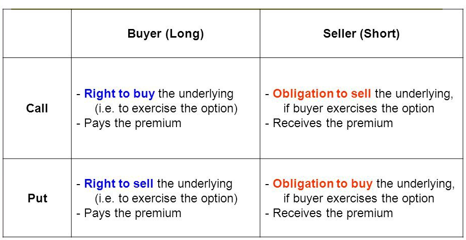
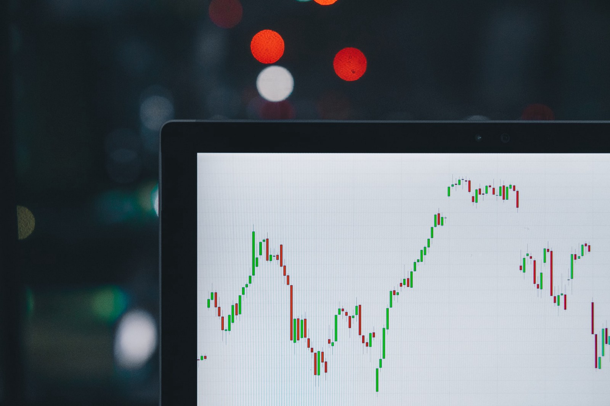
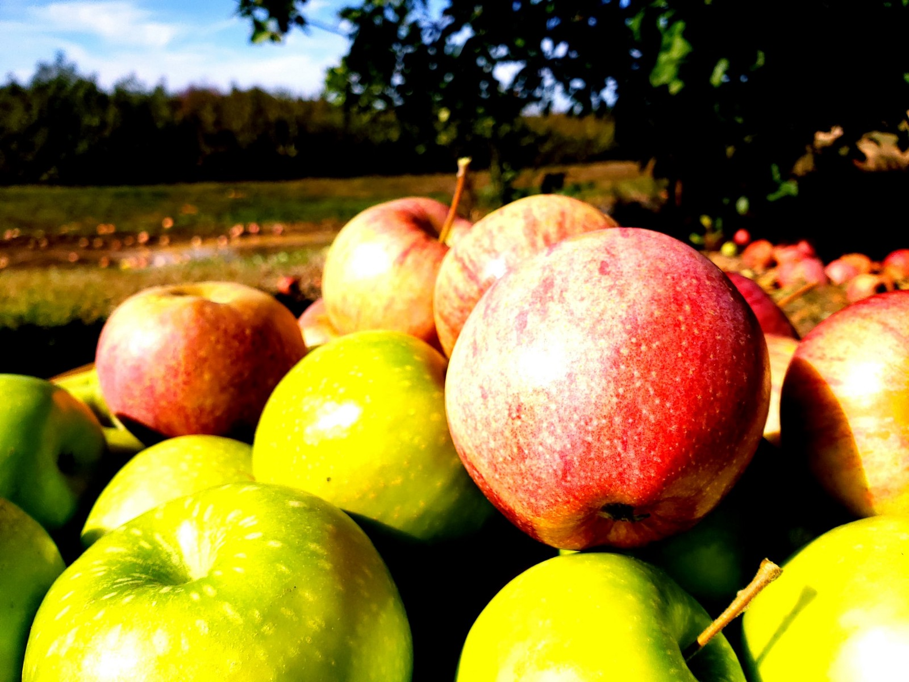

## Underlying Assets

Underlying assets are the assets upon which an option is based. Underlying assets represent the assets from which the options derive their value. As in the example above, the apples are basically the option’s underlying asset.

In the traditional financial market, the underlying assets are normally stocks, indexes, foreign exchange, or even commodity futures. Here in the crypto market, underlying assets usually refer to a certain type of cryptocurrency, e.g. BTC or ETH.

## Option Type: Call or Put

As discussed above, options are contracts that give the buyer/holder the right, but not the obligation, to sell or buy an underlying asset. They are called call or put options, respectively.

[Call options](https://www.investopedia.com/terms/c/call.asp) allow the holder to buy an underlying asset at a certain price.

[Put options](https://www.investopedia.com/terms/p/put.asp) allow the holder to sell an underlying asset at a certain price.

In the [specific example](https://www.docs.finnexus.io/options/), the fruit store wants to “buy” apples in August, hence, it is buying a call option contract.

If we change the story a bit, the orchard owner worries that the apple price may drop in August, and he wants to fix his minimum profit. Therefore, he reaches a contract with the fruit store, that he may sell the apples at the price of $4/kg in August, but he doesn’t have to if the market price is higher. Then this contract is a typical put option contract.

Also, from these examples, we may see how call and put options work.

As the holder of a call option, he/she expects or concerns that the price may go higher, and hence will be too expensive to buy in the future, therefore, a call option gives him/her cost protection.

As the holder of a call option, he/she holds the underlying asset already expects or is concerned that the price may go lower, and affecting potential future profits, therefore, a put option gives him/her insurance on the profit.

## Sellers and Buyers

A contract normally has two parties, a seller and a buyer. An **option seller** is selling (shorting) an option contract to a buyer and getting the premium(the price of the option). An **option buyer** is buying (longing) an option contract from a seller and paying the premium. Also, note that the option can be a call or a put.

*Sellers and buyers*

 
 
## Strike Price

The [strike price](https://www.investopedia.com/terms/s/strikeprice.asp) (or exercise price) of an option is the price at which a put or call option can be exercised. For a call option, the strike price is the price at which the option holders can buy the underlying asset. For a put option, the strike price is the price at which the option holders can sell the underlying asset. It is predetermined in the options contracts.

Also, the strike price can have a big influence on the value of the options. For a call option, the lower the strike price is, which means the holders can buy the asset with lower costs, the higher the value of the option; and vice versa.

## Expiration Date

The expiration date of an option contract is the last date that the contract is valid, on which the holder has the right to exercise the option according to its terms.

Owners of **American-style options** may exercise at any time before the option expires, while owners of **European-style options** may exercise only at expiration.

The expiration dates may also have a significant influence on the value of the options. In general, the longer an option contract has to expiration, the higher value it will have.

*Volatile markets like bitcoin and cryptocurrency demand means to protect against both upside and downside risk. Options are the answer. Photo by [M. B. M.](https://unsplash.com/@m_b_m?utm_source=unsplash&utm_medium=referral&utm_content=creditCopyText) on [Unsplash](https://unsplash.com/s/photos/stock-options?utm_source=unsplash&utm_medium=referral&utm_content=creditCopyText).*

 

## Price Volatility

Price volatility, in relation to the options market, refers to the degree of fluctuation in the market price of the underlying asset. Price volatility data sometimes is not easily acquired and often calculated as a prediction of the degree to which underlying asset price moves in the future.

Obviously, the price volatility has a direct influence on the option value. The more volatile the price is, the more difficult it is to make predictions in the future, which gives the option sellers more risk exposure, hence, the value of the option will be higher.

## Settlement

Settlement is the process for the terms of an options contract to be resolved between the holder and seller when it’s exercised. An option contract can be physically settled or cash-settled.

**Physically settled options** require the actual delivery of the underlying assets. When exercising, the holder of physically settled call options would, therefore, buy the underlying assets, whereas the holder of physically settled put options would sell the underlying assets.

**Cash-settled options** do not require the actual delivery of the underlying assets. Instead, the market value, at the exercise date, of the underlier is compared to the strike price, and the difference (if in a favorable direction) is paid by the option seller to the owner.

*Photo by [George Huffman](https://unsplash.com/@ghuffmanphotography?utm_source=unsplash&utm_medium=referral&utm_content=creditCopyText) on [Unsplash](https://unsplash.com/s/photos/apple?utm_source=unsplash&utm_medium=referral&utm_content=creditCopyText)
*

 

With the apple example above, if the apple price is higher than $4/kg in August, if the options were physically settled options, it would mean that the fruit store purchases the apples at the previously agreed upon price and the orchard owner makes the delivery. If the options were cash settled options, it would mean that the orchard owner pays the difference in cash between the market price and the previously agreed upon price, times the total kilograms covered by the contract, to the fruit store.

## Option Moneyness

In-the-money, at-the-money and out-of-the-money are commonly used terms that refer to an option's moneyness, an insight into the [intrinsic value](https://www.investopedia.com/terms/i/intrinsicvalue.asp) of these derivatives contract.

At-the-money (ATM) options have a strike price exactly equal to the current price of the underlying asset.

Out-of-the-money (OTM) options have no intrinsic value, only "time value", and occur when a call's strike is higher than the current market, or a put's strike is lower than the market.

In-the-money (ITM) options have intrinsic value, meaning you can exercise the option immediately for a profit opportunity - i.e. if a call's strike is below the current market price or a put's strike is higher.

## Exercise

Exercise means to put into effect the right to buy or sell the underlying assets specified in an options contract.The holder of an option has the right, but not the obligation, to buy or sell the option's underlying asset at a specified price on or before a specified date in the future.

If the owners of an option decide to buy or sell the underlying asset—instead of allowing the contract to expire, worthless or closing out the position—they will be "exercising the option," or making use of the right, or privilege that is available in the contract.

Exercising a put option allows you to sell the underlying asset at a stated price within a specific timeframe.
Exercising a call option allows you to buy the underlying asset at a stated price within a specific timeframe.

## IV

IV stands for Implied Volatility.

It is a metric that captures the market's view of the likelihood of changes in a given asset's price. 

Implied volatility is often used to price options contracts: High implied volatility results in options with higher premiums and vice versa.

Implied volatility does not predict the direction in which the price change will proceed. Low volatility means that the price likely won't make broad, unpredictable changes.

Implied volatility can be determined by using an option pricing model. It is the only factor in the model that isn't directly observable in the market. Instead, the mathematical option pricing model uses other factors to determine implied volatility and the option's premium.

## BS Pricing Model

The Black Scholes model, also known as the Black-Scholes-Merton (BSM) model, is a mathematical model for pricing an options contract. It is the best known model for pricing options. The model won the Nobel prize in economics.
For the mathematical expression, please check the details [here](https://www.investopedia.com/terms/b/blackscholes.asp).

## Put-Call Parity

Put-call parity is a principle that defines the relationship between the price of European put options and European call options of the same class, that is, with the same underlying asset, strike price, and expiration date.
The equation expressing put-call parity is:

C + PV(x) = P + S

where:

C = price of the European call option

PV(x) = the present value of the strike price (x), discounted from the value on the expiration date at the risk-free rate

P = price of the European put

S = spot price or the current market value of the underlying asset

## Greeks

"Greeks" is a term used in the options market to describe the different dimensions of risk involved in taking an options position. These variables are called Greeks because they are typically associated with Greek symbols. Each risk variable is a result of an imperfect assumption or relationship of the option with another underlying variable. 

Delta (Δ) represents the rate of change between the option's price and a $1 change in the underlying asset's price. 

Theta (Θ) represents the rate of change between the option price and time, or time sensitivity - sometimes known as an option's time decay. 

Gamma (Γ) represents the rate of change between an option's delta and the underlying asset's price. 

Vega (v) represents the rate of change between an option's value and the underlying asset's implied volatility. 

Rho (p) represents the rate of change between an option's value and a 1% change in the interest rate.

## VIX

The Cboe Volatility Index, or VIX, is a real-time market index representing the market's expectations for volatility over the coming 30 days. Investors use the VIX to measure the level of risk, fear, or stress in the market when making investment decisions. Derived from the price inputs of the S&P 500 index options, it provides a measure of market risk and investors' sentiments. It is also known by other names like "Fear Gauge" or "Fear Index."

## Volatility Smile

Volatility smiles are implied volatility patterns that arise in pricing financial options.  
Theoretically, for options with the same expiration date, we expect the implied volatility to be the same regardless of which strike price we use. However, in reality, the IV we get is different across the various strikes. This disparity is known as the volatility skew.
If you plot the IV against the strike prices, you might get the following U-shaped curve resembling a smile. Hence, this particular volatility skew pattern is better known as the volatility smile.
:max_bytes(150000):strip_icc():format(webp)/VolatilitySmileDefinitionandUses2-6adfc0b246cf44e2bd5bb0a3f2423a7a.png)

## Volatility Surface

The volatility surface is a three-dimensional plot of the implied volatility of options, where the x-axis is the time to maturity, the z-axis is the strike price, and the y-axis is the implied volatility. 
An example of BTC Volatility Surface is shown as below.

