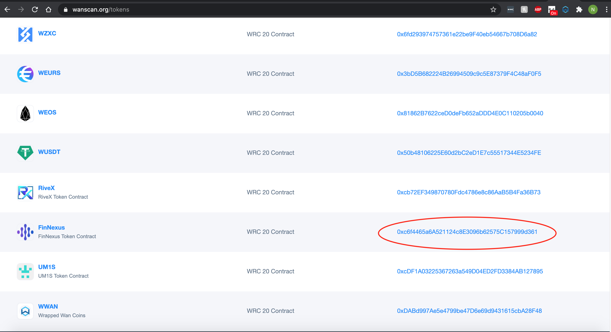
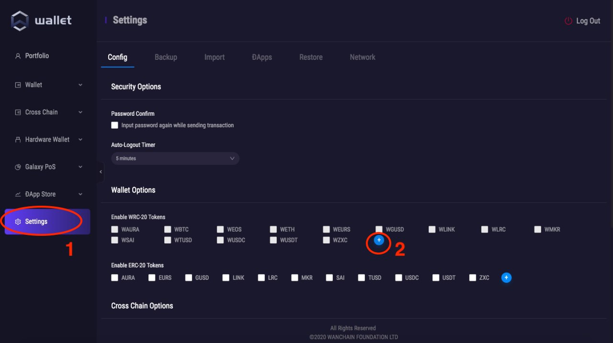
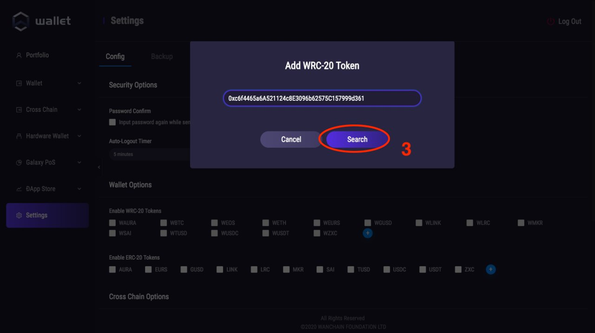
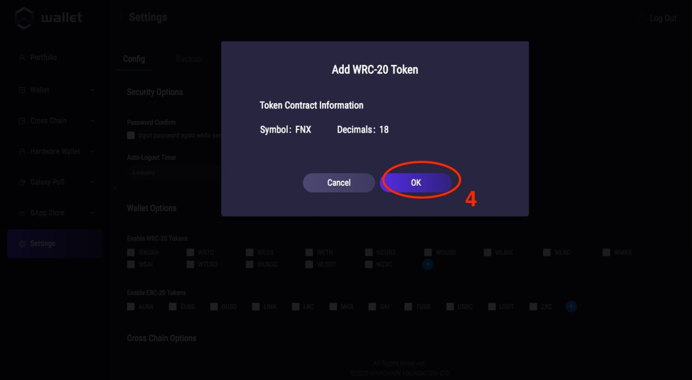
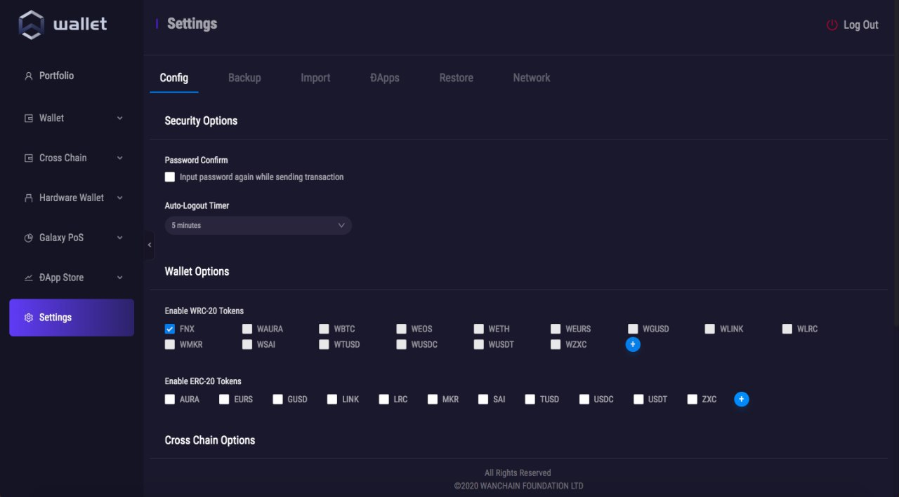
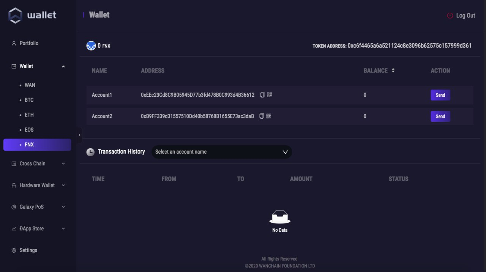

# How to Add FNX to Your Wanchain Desktop Wallet

1) Install the official Wanchain Desktop Wallet ([download here](https://www.wanchain.org/getstarted/), see wallet guides [here](https://www.explorewanchain.org/#/wallet_and_tools/wan-wallet) and [here](https://wanchain.guide/)). The mobile wallet is also supported but this guide only has specific instructions for adding FNX in the desktop wallet  

2) Find the FNX smart contract address on [https://www.wanscan.org/tokens](https://www.wanscan.org/tokens). WanScan is the only official source to get WRC20 token's smart contract addresses.   

  

3) In the "Settings" menu on your wallet, click the "+" sign under the "Enable WRC-20" section:  

  

4) In "Add WRC-20 Token" pop up window, paste the FNX token contract address you copied from WanScan, and click "Search". Make sure there are no blank spaces before or after the address in the input area so the wallet can read the address properly.

  

5) After clicking "Search", the window will display information about the FNX token. Click the "OK" button to add FNX to your wallet.

  

6) FNX can now be toggled to display or hide under the "Enable WRC-20" section in "Settings".

  

7) FNX is now available in the "Wallet" menu.

  
